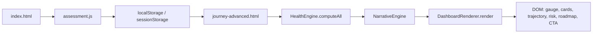
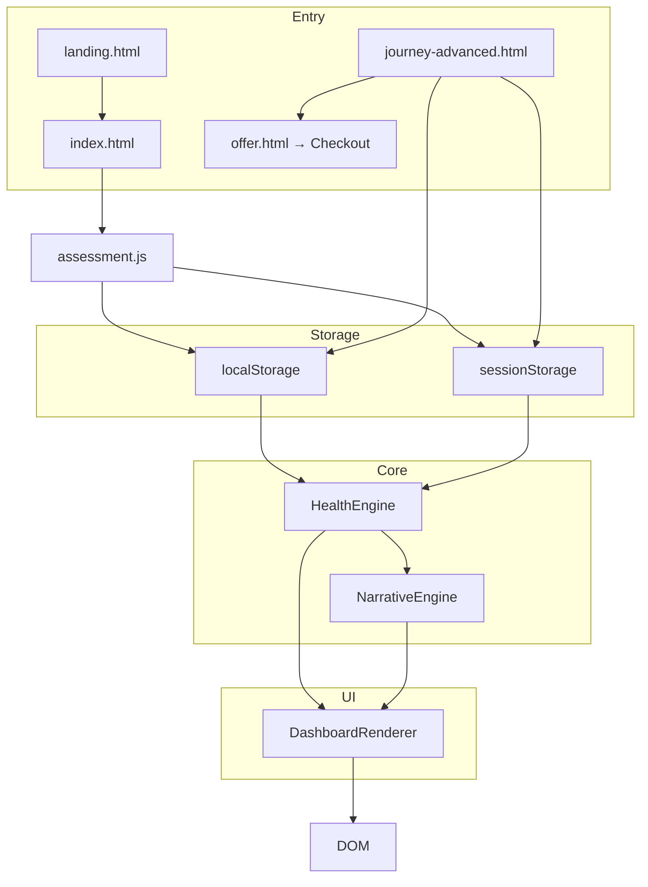

# Unlimitr AI Health Assessment Platform — Master Documentation

**Single source of truth for architecture, files, requirements, and relationships.**

---

## Table of Contents

1. [Project Overview](#1-project-overview)
2. [File Inventory & Purposes](#2-file-inventory--purposes)
3. [Architecture & Data Flow](#3-architecture--data-flow)
4. [Component Requirements](#4-component-requirements)
5. [Dependencies](#5-dependencies)
6. [Mobile Requirements](#6-mobile-requirements)
7. [Integration Points](#7-integration-points)
8. [Future Planning](#8-future-planning)

---

## 1. Project Overview

### 1.1 Platform Purpose and Goals

The **Unlimitr AI Health Assessment Platform** is a client-side web application that:

- Collects user health and lifestyle data through a structured 4-step assessment form.
- Computes **multidimensional health intelligence** (5 core dimensions: metabolic, recovery, hormonal, behavioral, readiness).
- Generates **clinical-grade narratives** and biological interpretations.
- Renders a **premium AI Health Dashboard** with gauges, dimension cards, trajectory simulation, risk forecast, and conversion blocks.

Goals include: providing a single source of truth for health scoring, supporting ML-ready output, maintaining a clinical-compassionate tone, and enabling plan recommendation and conversion flows.

### 1.2 High-Level Architecture

```
┌─────────────────────────────────────────────────────────────────────────────┐
│                         ENTRY POINTS (HTML)                                  │
│  landing.html → index.html → journey / journey-advanced → offer.html → Checkout │
└─────────────────────────────────────────────────────────────────────────────┘
                                        │
                                        ▼
┌─────────────────────────────────────────────────────────────────────────────┐
│                    ASSESSMENT & STORAGE (assets/js)                          │
│  assessment.js → validation, 4-step flow, localStorage/sessionStorage       │
└─────────────────────────────────────────────────────────────────────────────┘
                                        │
                                        ▼
┌─────────────────────────────────────────────────────────────────────────────┐
│                    CORE INTELLIGENCE LAYER (core/)                            │
│  HealthEngine.js → 5 dimensions, zones, top drivers, plan, dropout risk      │
│  narrativeEngine.js → executive summary, dimension narratives, trajectory   │
└─────────────────────────────────────────────────────────────────────────────┘
                                        │
                                        ▼
┌─────────────────────────────────────────────────────────────────────────────┐
│                    DASHBOARD RENDERING (root)                                │
│  dashboardRenderer.js → authority header, dimension grid, impact, roadmap   │
└─────────────────────────────────────────────────────────────────────────────┘
```

### 1.3 Technology Stack

| Layer | Technology |
|-------|------------|
| Markup | HTML5, semantic sections |
| Styling | CSS3, CSS variables, Bootstrap 5.3.2 (index/assessment) |
| Fonts | Google Fonts (Outfit, Inter) |
| Scripts | Vanilla JavaScript (ES5-style IIFE), no framework |
| Animation | GSAP 3.12.2, ScrollTrigger |
| Date picker | Flatpickr (assessment) |
| Optional PDF | jsPDF (dashboard download) |
| Data | JSON (knowledge base, training data); localStorage/sessionStorage |

### 1.4 Key Design Principles

- **Clinical tone**: Authoritative, data-backed, non-fear-based; reversibility language (e.g. "adaptive strain — not permanent damage").
- **Single computation path**: HealthEngine is the canonical scoring engine; legacy `assets/js/engine.js` and `healthScoring.js` exist for legacy journey/report flows.
- **ML-ready output**: Normalized numerical encoding (sleep 1–4, stress 1–4, activity 1–4), `mlFeatures` and structured output for potential TensorFlow.js or server-side ML.
- **Progressive enhancement**: Dashboard works with fallback data if HealthEngine fails; NarrativeEngine can be instantiated from window or passed into DashboardRenderer.
- **Modular core**: Core layer (`core/`) is designed for reuse; dashboard and assessment are separate consumers.

---

## 2. File Inventory & Purposes

### 2.1 HTML Entry Points

**User flow:** `landing.html` → `index.html` → `journey.html` / `journey-advanced.html` → `offer.html` → **Checkout**

| File | Purpose |
|------|---------|
| **landing.html** | Marketing landing page; entry point that leads users into the assessment. |
| **index.html** | Main assessment form: 4-step flow (Personal Details, Body & Goals, Lifestyle, Health & Commitment). Uses Flatpickr for DOB, sliders for height/weight/target, validation, Lottie loader. On submit → stores assessment and redirects to **journey.html**. |
| **journey.html** | Legacy dashboard: OTP unlock, mobile verification, report handoff to offer. Reads from localStorage/sessionStorage. |
| **journey-advanced.html** | **Premium AI Health Dashboard**: Loads HealthEngine, NarrativeEngine, DashboardRenderer; reads assessment from storage; renders authority header, dimension grid, impact map, trajectory, risk forecast, roadmap, conversion block. Alternative destination for “advanced” report experience. |
| **offer.html** | Plan unlock/pricing: reads handoff data (e.g. from journey-report or app), displays plan options; leads to **Checkout**. |

### 2.2 Core Intelligence Layer (`core/`)

| File | Purpose |
|------|---------|
| **HealthEngine.js** | Multidimensional health scoring engine (v2.0). Normalizes user input, computes 5 dimensions (metabolic, recovery, hormonal, behavioral, readiness), aggregate score, risk zone, biological strain, top drivers, correction window, dropout risk weeks, plan recommendation; outputs ML-ready structure and dimension narratives. |
| **narrativeEngine.js** | Clinical narrative generation from HealthEngine output: executive summary, dimension narratives, driver analysis, trajectory forecast, dropout risk narrative, plan rationale, full report. Exposes legacy `generateReport` / `CognitiveCounsellor` for backward compatibility. |
| **ai-knowledge-base.json** | Structured knowledge base (identity, scoring weights, risk zones, condition rules, plan logic, report template). HealthEngine can use inline default KB or override via constructor. |
| **README.md** | Core layer documentation: architecture sketch, usage example, numerical encoding. |

### 2.3 Dashboard Rendering

| File | Purpose |
|------|---------|
| **dashboardRenderer.js** | Clinical intelligence dashboard builder. Consumes HealthEngine output and optional NarrativeEngine instance; renders authority header (gauge + narrative), dimension grid (cards + mini gauges), impact section (body silhouette + tooltip), trajectory section (dual-path + SVG), risk forecast (12-week grid), roadmap (milestones + scrub animation), conversion block; handles GSAP/ScrollTrigger animations and fallback data. |

### 2.4 Supporting JavaScript

| File | Purpose |
|------|---------|
| **ai_app.js** | App-level helpers: `APP_STORAGE_KEY` (`ai_health_assessment_v1`), `saveAssessment`/`loadAssessment`, BMI/BMR/metabolic age, plan catalog, navigation (e.g. to `ai_journey.html`). |
| **assets/js/assessment.js** | Assessment form: 4-step wizard, Flatpickr DOB, height/weight/target sliders, validation, health issues/diet/commitment collection. On submit builds `assessmentData`, saves to `localStorage`/`sessionStorage` under `assessmentData` and optionally `saveAssessment()`, then redirects to **journey.html**. |
| **assets/js/engine.js** | Legacy health calculation engine: saves/loads with `APP_STORAGE_KEY`, used by legacy journey/report flows. |
| **assets/js/journey.js** | Legacy journey page logic (OTP, unlock, navigation). |
| **assets/js/journey-report.js** | Legacy report rendering: loads assessment from multiple storage keys, renders scores/charts, OTP overlay, handoff to offer (e.g. `HANDOFF_KEY`). |
| **assets/js/core/healthScoring.js** | 5-dimension scoring (Metabolic, Hormonal, Behavioral, Recovery, RiskMomentum) — legacy model used by legacy flows. |
| **assets/js/core/behaviorClassifier.js** | Behavior type classification (A–E): High Motivation/Low Discipline, Emotional Eating, Overtrained, Start-Stop, High Compliance. Used for tone-adjusted narratives in legacy path. |
| **assets/js/core/narrativeEngine.js** | Legacy narrative engine (may duplicate or wrap core/narrativeEngine for legacy pages). |
| **assets/js/core/index.js** | Core module index/aggregator for assets. |
| **assets/js/core/planRecommendation.js** | Plan recommendation logic (legacy). |
| **assets/js/core/riskGradient.js** | Risk gradient utilities. |
| Other **assets/js/** | Various feature modules: voice-coach, transformation-timeline, scroll-intelligence, risk-radar, recalibration-core, otp-unlock, offer, ml-engine, morph-engine, metabolic-simulation, intelligence-engine, health-intelligence, gamification-engine, biological-engine, behavioral-engine, body-morph, ambient-engine, ai-live-engine, etc. Used by journey/report or future features. |

### 2.5 Styling

| File | Purpose |
|------|---------|
| **assets/css/theme.css** | Theme variables, base styles, responsive (e.g. `@media (max-width: 768px)`). |
| **assets/css/dashboard.css** | Dashboard-specific styles. |
| **assets/css/premium-dashboard.css** | Premium dashboard styles. |
| **assets/css/live-cards.css** | Live card components; breakpoints at 768px. |
| **ai_app.css** | Application-level styles; mobile breakpoint 768px. |
| **journey-advanced.html** | Inline styles for authority header, gauge, drivers, impact, trajectory, risk, roadmap, conversion (including 640px / 768px / 1024px breakpoints). |

### 2.6 Data & ML

| File | Purpose |
|------|---------|
| **ml/training-data.json** | ML-ready dataset (TensorFlow.js compatible); numerical encoding aligned with HealthEngine. |
| **assets/data/AI_Knowledge_Base.json** | Knowledge base asset (may mirror or extend core/ai-knowledge-base.json). |

### 2.7 Other Assets

- **assets/svg/** — radar-grid, male/female body silhouettes (fit/fat).
- **assets/shaders/** — bodyVertex.glsl, bodyFragment.glsl (WebGL).
- **assets/js/webgl/** — three-core, risk-radar-3d, hologram-engine, body-scene, bio-state.
- **assets/js/components/** — SemiArcCard, ScoreEngine, RecalibrationCore, LiveCard, GlassParallax, AdaptiveCurve, AIRadar.

---

## 3. Architecture & Data Flow

**Full user journey:** `landing.html` → `index.html` → `journey.html` or `journey-advanced.html` → `offer.html` → **Checkout**

### 3.1 End-to-End Data Flow (Assessment → Dashboard)



### 3.2 Component Relationship Diagram



### 3.3 Assessment → Scoring → Narrative → Dashboard (Detailed)

1. **Assessment (index.html + assessment.js)**  
   User completes 4 steps. On submit, script builds `assessmentData` (e.g. clientName, clientEmail, dateOfBirth, age, gender, height, weight, targetWeight, activityLevel, sleepQuality, stressLevel, healthIssues, primaryGoal, commitment, obstacles, condition-specific fields). Data is written to:
   - `localStorage.assessmentData`
   - `sessionStorage.assessmentData`
   - Optionally `saveAssessment(assessmentData)` → `localStorage.ai_health_assessment_v1`  
   Redirect is to **journey.html** (not journey-advanced by default).

2. **Dashboard load (journey-advanced.html)**  
   Inline script (in dashboardRenderer.js `init`) reads assessment in this order:
   - `localStorage.assessmentData`
   - `sessionStorage.assessmentData`
   - `localStorage.ai_health_assessment_v2`
   - `sessionStorage.ai_health_assessment_v2`  
   If none, uses fallback demo payload.

3. **HealthEngine**  
   `new HealthEngine(data)` normalizes input (sleep/stress/activity to 1–4, health_* flags). `computeAll()` returns:
   - `totalScore`, `zone`, `dimensions`, `topDrivers`, `correctionWindowWeeks`, `dropoutRiskWeeks`, `planRecommendation`
   - Plus `biologicalStrain`, `dimensionNarratives`, `mlFeatures`, `timestamp`, `version`.

4. **NarrativeEngine**  
   `new NarrativeEngine(engineOutput)`; methods like `generateExecutiveSummary()`, `generateDimensionNarrative()`, `generateTrajectoryForecast()`, etc., produce copy for the dashboard.

5. **DashboardRenderer**  
   `new DashboardRenderer(engineOutput, narrativeEngine)`; `render()` fills authority header, dimension grid, impact tooltip, trajectory copy, risk grid, roadmap, conversion block; draws gauges and trajectory SVG; wires GSAP/ScrollTrigger.

### 3.4 Storage Keys and Formats

| Key | Where set | Format |
|-----|-----------|--------|
| `assessmentData` | assessment.js | JSON: full assessment payload (clientName, height, weight, activityLevel, sleepQuality, stressLevel, commitment, healthIssues, primaryGoal, etc.) |
| `ai_health_assessment_v1` | ai_app.js saveAssessment() | JSON: same shape as assessment payload |
| `ai_health_assessment_v2` | (optional alternate) | JSON: assessment-like; dashboard init reads it as fallback |
| `REPORT_HANDOFF_KEY` (offer) | journey-report.js | Handoff object for offer page |
| OTP/session | otp-unlock.js | sessionStorage for verification state (intentionally not localStorage) |
| `abis_xp` | gamification-engine.js | JSON: gamification state |

---

## 4. Component Requirements

### 4.1 HealthEngine

**Role**: Multidimensional health scoring engine; single source of truth for scores and derived outputs.

**Input**

- **userData** (object): Assessment payload. Expected/normalized fields include:
  - Numeric or string: `height`, `weight`, `targetWeight`, `age`, `gender`
  - Categorical (string or normalized to number): `sleepQuality` / `sleep` (1–4), `stressLevel` / `stress` (1–4), `activityLevel` / `activity` (1–4)
  - String: `healthIssues`, `primaryGoal`, `commitment`, `obstacles`
  - Condition-specific: `menstrualCycle`, `thyroidType`, `tshLevel`, `hba1cLevel`, `fastingSugar`, `pcosSymptoms`, `insulinResistance`, etc.
- **knowledgeOverride** (optional): Custom KB (weights, riskZones, conditionRules, planLogic, reportTemplate). If omitted, uses built-in `DEFAULT_KB`.

**Output (computeAll())**

- **totalScore** (0–100), **zone** (string), **dimensions** (metabolic, recovery, hormonal, behavioral, readiness), **topDrivers** (top 3 by impact), **correctionWindowWeeks**, **dropoutRiskWeeks** (array), **planRecommendation** (duration, intensity, type).
- **biologicalStrain**, **dimensionNarratives**, **mlFeatures**, **timestamp**, **version**.

**Dimension rules (summary)**

- **Metabolic**: BMI, activity, diabetes flag; penalties per spec (e.g. BMI > 27 → −20).
- **Recovery**: Sleep and stress (normalized); poor sleep / high stress reduce score.
- **Hormonal**: Thyroid, PCOS flags; stress contribution.
- **Behavioral**: Commitment, stress, sleep.
- **Readiness**: Primary goal, healthIssueMain.

**Normalization**

- Sleep: poor→1, inconsistent→2, good→3, restorative→4.
- Stress: low→1, moderate→2, high→3, very-high→4.
- Activity: sedentary/low→1, light→2, moderate→3, high→4.
- Health: `health_diabetes`, `health_thyroid`, `health_pcos`, `healthIssueMain` derived from `healthIssues` string.

**Requirements**

- All dimension scores clamped 0–100.
- Aggregate score = weighted sum (default weights: metabolic 0.30, hormonal 0.20, behavioral 0.20, recovery 0.15, readiness 0.15).
- Risk zones: &lt;40 Severe Adaptive Strain, 40–59 Adaptive Strain, 60–74 Suboptimal Stability, 75–100 Metabolic Stability.
- Top drivers: sort by impact (100 − dimension score), return top 3.
- Correction window: score-based weeks (e.g. &lt;40 → 16, &lt;50 → 14, …).
- Dropout risk weeks: derived from behavioral/recovery/commitment (e.g. 3, 4).
- Plan recommendation: duration (months), intensity, type by score band; optional top-driver adjustment (e.g. hormone-aware, recovery-focused).

### 4.2 NarrativeEngine

**Role**: Turn HealthEngine output into clinical, authoritative copy for the dashboard and reports.

**Input**

- **engineOutput** (object): Result of `HealthEngine.prototype.computeAll()` (totalScore, zone, dimensions, topDrivers, correctionWindowWeeks, dropoutRiskWeeks, planRecommendation).

**Outputs (methods)**

- **generateExecutiveSummary()**: Single paragraph: zone, score, “reversible”, primary driver.
- **generateDimensionNarrative(dimension, value)**: Per-dimension clinical text (metabolic, recovery, hormonal, behavioral, readiness) with thresholds (e.g. &lt;50, &lt;70, else).
- **generateDriverAnalysis()**: Top drivers with approximate % suppression.
- **generateTrajectoryForecast()**: `{ withoutIntervention, withIntervention }` strings.
- **generateDropoutRiskNarrative()**: Text for dropout risk weeks and behavioral index.
- **generatePlanRationale()**: Duration, intensity, zone, behavioral %, top driver, correction window.
- **generateFullReport()**: Markdown-style full report (executive summary, dimension analysis, drivers, trajectory, dropout risk, plan rationale).

**Requirements**

- Tone: clinical, compassionate, data-backed; no fear-based or shaming language; use “reversible” and “adaptive” framing.
- All copy derived from engine output; no hardcoded user names except via legacy `generateCounsellorMessage` (clientName/clientEmail).
- Backward compatibility: `generateReport(data)` and `generateCounsellorMessage(data)` remain for legacy callers.

### 4.3 DashboardRenderer

**Role**: Build the premium clinical intelligence dashboard UI from engine output and narratives.

**Input**

- **engineOutput** (object): HealthEngine `computeAll()` result.
- **narrativeEngine** (object or null): NarrativeEngine instance. If null, renderer uses `window.NarrativeEngine` to create one from engineOutput, or falls back to default text.

**Rendering methods (called by render())**

- **renderAuthorityHeader()**: Fills `#authorityNarrative`, `#gaugeStatus`, `#gaugeSubtext`; draws main gauge (`#mainGauge`); uses NarrativeEngine `generateExecutiveSummary()`.
- **renderDimensionGrid()**: Clears `#driversGrid`; for each dimension builds driver card (title, severity badge, top-driver badge, mini gauge, score, narrative); draws mini gauges; sets up body interactions.
- **renderImpactSection()**: Fills `#impactTooltip` with driver analysis from NarrativeEngine.
- **renderTrajectorySection()**: Fills `#trajectoryCopy` with trajectory forecast; draws trajectory SVG.
- **renderRiskForecast()**: Fills risk subtext from dropout narrative; builds 12-week risk grid (high/moderate/stable).
- **renderRoadmap()**: Fills `#roadmapMilestones` with fixed milestones (weeks 2, 4, 8, 12); ScrollTrigger scrub for line/node.
- **renderConversionBlock()**: Plan rationale and CTAs (e.g. “See My Recommended Solution”, “Download Full Intelligence Report”).
- **animateEntry()**: GSAP/ScrollTrigger for section and card reveals.

**Requirements**

- DOM: expects `main.app-shell` (or body), and section IDs: authorityHeader, driversGrid, impactSection, impactTooltip, trajectorySection, trajectoryCopy, trajectorySvg, riskSection, riskGrid, roadmapSection, roadmapMilestones, roadmapLine, roadmapNode, conversionSection, downloadReportBtn.
- If sections are missing, methods no-op gracefully.
- GSAP/ScrollTrigger: register plugin if `gsap` exists; use for stagger, scrub, and section reveals.
- Fallback: if HealthEngine or NarrativeEngine unavailable, use default copy and fallback intelligence object (e.g. totalScore 62, sample dimensions, topDrivers, correctionWindowWeeks, dropoutRiskWeeks, planRecommendation).
- Download: “Download Full Intelligence Report” uses jsPDF if present, else `window.print()`.

---

## 5. Dependencies

### 5.1 External Libraries

| Library | Typical use | Where |
|---------|-------------|--------|
| Bootstrap 5.3.2 | Grid, forms, utilities | index.html |
| GSAP 3.12.2 | Animations | journey-advanced.html, dashboardRenderer.js |
| ScrollTrigger (GSAP) | Scroll-linked animations | journey-advanced.html, dashboardRenderer.js |
| Flatpickr | Date of birth picker | index.html, assessment.js |
| Google Fonts (Outfit, Inter) | Typography | index.html, journey-advanced.html |
| Lottie (optional) | Loading animation | assessment.js (submit) |
| jsPDF (optional) | PDF export | dashboardRenderer.js (download button) |

### 5.2 Internal Dependencies (Load Order)

**journey-advanced.html**

1. GSAP + ScrollTrigger  
2. core/HealthEngine.js  
3. core/narrativeEngine.js  
4. assets/js/core/narrativeEngine.js (if used for legacy compatibility)  
5. dashboardRenderer.js  

**index.html**

- Bootstrap, theme.css, Flatpickr CSS  
- assessment.js (and any engine/ai_app if referenced)  

### 5.3 Dependency Graph (Core → Dashboard)

- **DashboardRenderer** depends on: HealthEngine output shape, NarrativeEngine (or window.NarrativeEngine), DOM structure, GSAP/ScrollTrigger.
- **NarrativeEngine** depends on: HealthEngine output shape only.
- **HealthEngine** depends on: none (optional KB override).

---

## 6. Mobile Requirements

### 6.1 Current Mobile Support Status

- **Viewport**: All main HTML files set `<meta name="viewport" content="width=device-width, initial-scale=1.0" />`.
- **Responsive CSS**: 
  - journey-advanced.html: breakpoints at 640px, 768px, 1024px for grid layout, roadmap milestones, authority inner layout.
  - theme.css: `@media (max-width: 768px)`.
  - live-cards.css, ai_app.css: 768px breakpoints.
  - landing.html: 768px and 992px.
- **Touch**: No dedicated touch handlers documented; standard click/keyboard used.
- **Navigation**: Assessment is a single column on small screens; dashboard sections stack. No dedicated mobile navigation drawer documented.
- **Storage**: Same localStorage/sessionStorage keys; no separate mobile storage strategy.
- **OTP / journey**: journey.html has mobile section (phone input for verification); OTP unlock uses sessionStorage.

### 6.2 Mobile Report UI Requirements (Reference)

- Mobile report UI should remain readable and actionable on small screens: typography scale, tap targets (min ~44px), reduced motion where appropriate.
- Dashboard elements that should be verified on mobile: gauge size, dimension card grid (single column on narrow), trajectory graph readability, risk grid (12 blocks), roadmap milestones (2 columns then 4), conversion CTAs (stacked or full-width).
- Future: consider a dedicated “mobile report” layout (e.g. condensed folds, swipeable sections, or bottom sheet for CTAs) if design spec exists.

### 6.3 Responsive Breakpoints (Summary)

| Breakpoint | Usage |
|------------|--------|
| 640px | journey-advanced (e.g. drivers grid) |
| 768px | theme.css, ai_app.css, live-cards, journey-advanced (authority inner, roadmap columns) |
| 992px | landing |
| 1024px | journey-advanced (wider layout) |

### 6.4 Mobile Implementation Roadmap (Future)

- Audit touch targets and font sizes on assessment and dashboard.
- Optionally add `prefers-reduced-motion` for GSAP/ScrollTrigger.
- Consider lazy-loading below-the-fold assets on slow networks.
- If a dedicated “mobile report” design is provided, add a mobile-specific layout or CSS branch.

---

## 7. Integration Points

### 7.1 How Components Connect

- **Assessment → Storage**: assessment.js builds object and writes to `assessmentData` and optionally `ai_health_assessment_v1`. Redirect goes to journey.html; to use premium dashboard, user must open journey-advanced.html (or redirect could be changed to journey-advanced).
- **Dashboard → Storage**: dashboardRenderer.js `init()` reads assessment from storage (see 3.4), then runs HealthEngine → NarrativeEngine → DashboardRenderer.
- **Dashboard → Core**: HealthEngine and NarrativeEngine are used as constructors; no direct dependency from core to dashboard.
- **Offer flow**: journey-report.js (and similar) builds handoff object and redirects to offer.html; offer.js reads `REPORT_HANDOFF_KEY` from localStorage.

### 7.2 Data Passing Mechanisms

- **Assessment → Engine**: Plain object; keys match form names and normalized names (e.g. sleepQuality vs sleep).
- **Engine → Narrative**: Full `computeAll()` output object.
- **Engine + Narrative → Renderer**: Renderer holds references to engine output and narrative instance; calls narrative methods per section.
- **Page-to-page**: localStorage and sessionStorage; keys documented in 3.4.

### 7.3 Event Flows

- **Assessment submit**: Form submit → validate → build payload → save → (optional Lottie) → redirect.
- **Dashboard load**: DOMContentLoaded (or immediate if already loaded) → init() → load data → HealthEngine.computeAll() → new NarrativeEngine → new DashboardRenderer → render() → animateEntry(); download button click → jsPDF or print.
- **Scroll**: ScrollTrigger drives section reveals, roadmap scrub, and any stagger animations.

### 7.4 Storage Keys and Formats (Recap)

- **assessmentData** / **ai_health_assessment_v1** / **ai_health_assessment_v2**: JSON assessment payload.
- **REPORT_HANDOFF_KEY** (offer): Handoff object (e.g. finalScore, riskCategory, weightGap, durationMonths, conditionType, recommendedWeeklyLoss).
- OTP/session: sessionStorage (otp-unlock).
- **abis_xp**: Gamification state (localStorage).

---

## 8. Future Planning

### 8.1 Known Issues / Limitations

- **Redirect**: Assessment currently redirects to journey.html; premium dashboard is journey-advanced.html. Users may need to navigate manually or redirect could be updated.
- **Dual narrative engines**: Both `core/narrativeEngine.js` and `assets/js/core/narrativeEngine.js` exist; clarify which is canonical for which pages to avoid drift.
- **Storage key spread**: Multiple keys (`assessmentData`, `ai_health_assessment_v1`, `ai_health_assessment_v2`) used in different places; consider standardizing one key for “last assessment” and migrating readers.
- **PDF**: jsPDF is optional; if not loaded, download falls back to print. PDF layout is minimal; could be enhanced for full report.

### 8.2 Enhancement Opportunities

- Unify assessment → journey-advanced flow (single redirect or in-app navigation).
- Add server-side or TensorFlow.js ML refinement using `mlFeatures` and ml/training-data.json (e.g. blend rule-based score with ML score).
- Richer PDF export using NarrativeEngine.generateFullReport() and better formatting.
- Theming: centralize CSS variables (e.g. journey-advanced inline vars) into theme.css for consistency.
- Accessibility: ensure stepper, gauges, and interactive elements have ARIA and keyboard support.

### 8.3 Technical Debt

- Legacy engine (assets/js/engine.js) and healthScoring.js/behaviorClassifier.js duplicate or overlap with HealthEngine; consider deprecating or clearly fencing legacy paths.
- Many optional assets/js modules (voice-coach, morph-engine, etc.); document which are required for which entry points and trim unused scripts from critical path.
- journey-advanced.html inline styles: consider moving to premium-dashboard.css or a dedicated file for maintainability.

### 8.4 Mobile Roadmap

- See 6.4: audit touch/readability, reduced motion, optional mobile-specific layout.

---

*End of Master Documentation. For component-level API details, see source comments in core/HealthEngine.js, core/narrativeEngine.js, and dashboardRenderer.js.*
